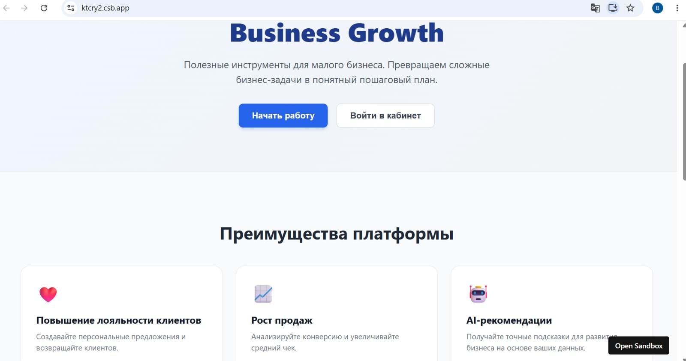
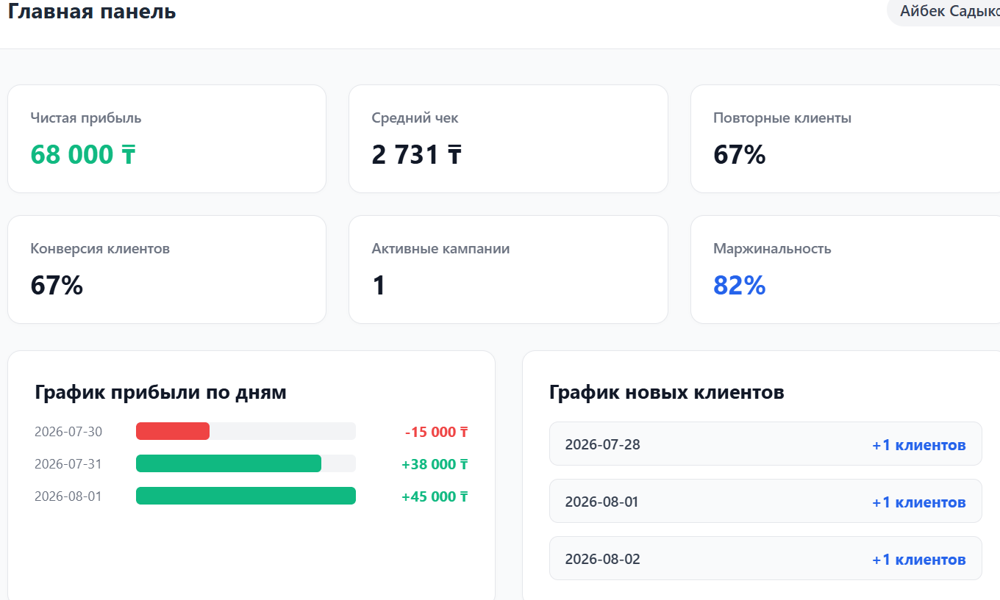
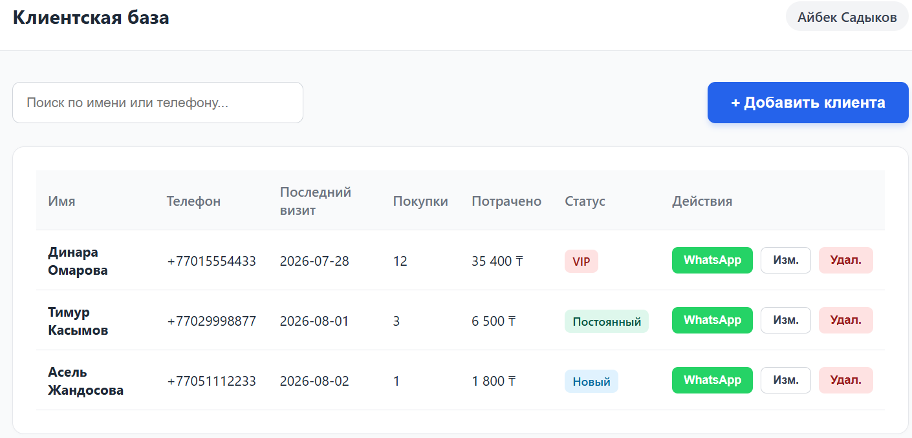
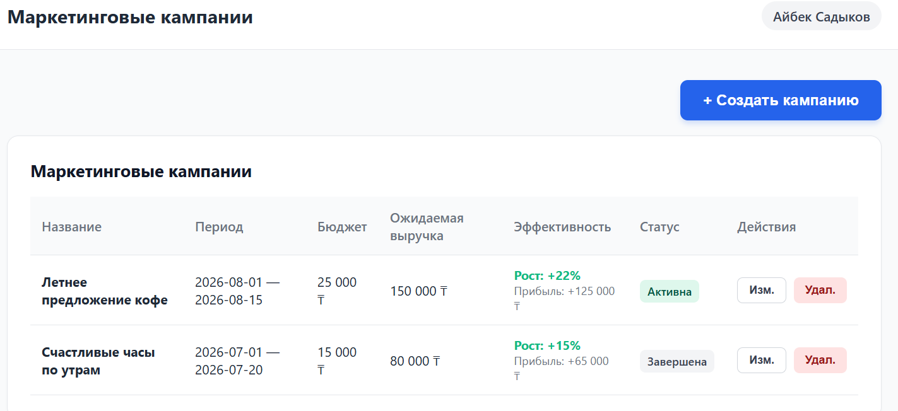
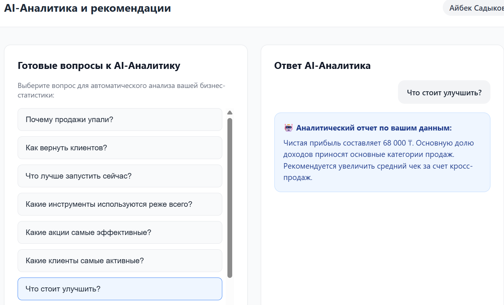
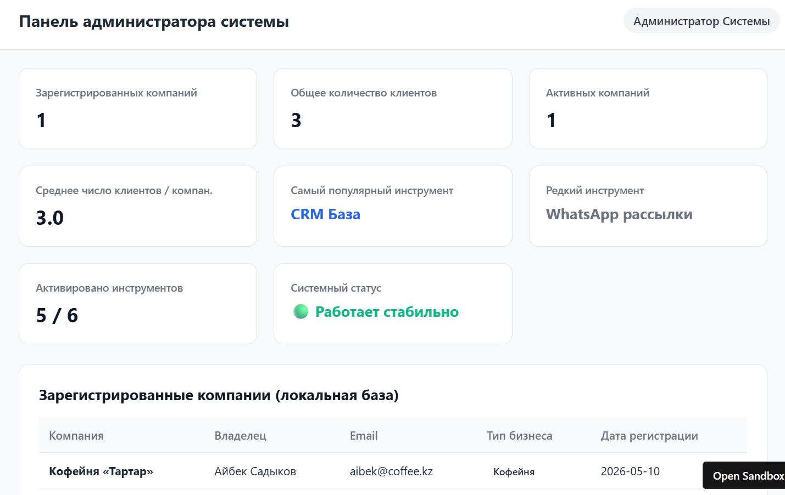

# 🚀 Business Growth | BABAM KANAY Team
> **Business Growth** — это полностью рабочий MVP цифровой платформы для малого бизнеса, разработанный в рамках **SERPIN Business Tournament 2026**.
>
> Платформа доступна для тестирования и демонстрирует полный пользовательский сценарий: регистрация, анализ бизнеса, AI-рекомендации, использование цифровых инструментов, создание маркетинговых акций, аналитика, личный кабинет и административные функции.

## Цифровая платформа для развития малого офлайн-бизнеса

**Business Growth** — это MVP веб-платформы, разработанной в рамках **SERPIN Business Tournament 2026**.

Проект создан для решения одной из ключевых проблем малого бизнеса — недостатка доступных цифровых инструментов для привлечения клиентов, повышения лояльности и анализа эффективности бизнеса.

Business Growth объединяет современные технологии, аналитику и интеллектуальные рекомендации в единой платформе, позволяя предпринимателям развивать свой бизнес без специальных технических знаний.

---

# 🎯 Цель проекта

Создать доступную цифровую экосистему для малого бизнеса, которая помогает предпринимателям:

- увеличивать количество клиентов;
- повышать повторные продажи;
- создавать маркетинговые акции;
- использовать программы лояльности;
- анализировать показатели бизнеса;
- получать персональные рекомендации по развитию.

---

# ❗ Проблема

Многие владельцы малого бизнеса продолжают вести бизнес без современных цифровых инструментов.

Это приводит к:

- снижению конкурентоспособности;
- отсутствию постоянных клиентов;
- сложностям в продвижении;
- неэффективному использованию маркетинга;
- отсутствию аналитики для принятия решений.

Business Growth решает эти проблемы, объединяя все необходимые инструменты в одной платформе.

---

# 🖼 Интерфейс платформы

Ниже представлены основные экраны платформы **Business Growth**, демонстрирующие полный пользовательский путь — от знакомства с платформой до управления бизнесом и получения аналитики.

---

## 🏠 Главная страница

Главная страница знакомит пользователя с возможностями платформы и позволяет начать работу с системой.



---

## 📊 Панель управления

После анализа бизнеса пользователь попадает в личную панель управления, где отображаются ключевые показатели и доступные инструменты.



---

## 👥 База клиентов

Раздел для просмотра клиентской базы, управления информацией о клиентах и анализа взаимодействия с ними.



---

## 🎁 Управление маркетинговыми кампаниями

Предприниматель может создавать и управлять маркетинговыми акциями, специальными предложениями и программами лояльности.



---

## 🤖 AI Business Analytics

Раздел интеллектуальной аналитики предоставляет персонализированные рекомендации и помогает принимать решения на основе данных.



---

## ⚙ Административная панель

Административная панель предназначена для управления платформой, просмотра зарегистрированных компаний и контроля основных функций системы.



---

# ✨ Основные возможности платформы

## 👤 Регистрация и авторизация

Пользователь может:

- зарегистрировать новый аккаунт;
- войти в систему;
- начать работу с платформой.

---

## 🏪 Анализ бизнеса

После регистрации предприниматель заполняет информацию:

- тип бизнеса;
- размер бизнеса;
- основная цель;
- количество клиентов;
- описание текущей проблемы.

На основании этих данных формируется персональный профиль бизнеса.

---

## 🤖 AI-анализ и рекомендации

Платформа автоматически анализирует введённую информацию и формирует рекомендации по развитию бизнеса.

В зависимости от типа бизнеса пользователь получает индивидуальные советы по:

- привлечению новых клиентов;
- увеличению продаж;
- повышению лояльности;
- запуску рекламных кампаний.

---

## 🧰 Инструменты для развития бизнеса

Платформа предоставляет цифровые инструменты, которые помогают предпринимателю:

- запускать программы лояльности;
- создавать специальные предложения;
- использовать маркетинговые инструменты;
- развивать клиентскую базу.

---

## 🎁 Создание маркетинговых акций

Пользователь может:

- создавать акции;
- управлять предложениями;
- использовать бонусные программы;
- мотивировать клиентов совершать повторные покупки.

---

## 📊 Аналитика бизнеса

После анализа предприниматель получает основные показатели эффективности:

- прогноз роста прибыли;
- прогноз удержания клиентов;
- показатели развития бизнеса;
- результаты внедрения рекомендаций.

---

## 👨‍💼 Личный кабинет

В личном кабинете пользователь может:

- просматривать результаты анализа;
- использовать рекомендации;
- работать с инструментами платформы;
- управлять своим аккаунтом.

---

## ⚙ Административная панель 

Администратор платформы имеет возможность:

- контролировать содержимое платформы;
- анализировать зарегистрированные компании и их клиентов.

---

# ✅ Реализованные сценарии MVP

Платформа поддерживает полный пользовательский сценарий:

✔ Регистрация пользователя

✔ Авторизация

✔ Заполнение информации о бизнесе

✔ Анализ бизнеса

✔ Получение AI-рекомендаций

✔ Просмотр цифровых инструментов

✔ Использование ключевой функции платформы

✔ Создание маркетинговой акции

✔ Просмотр аналитики

✔ Работа с личным кабинетом

✔ Использование административных функций

---

# 🛠 Используемые технологии

- React
- TypeScript
- React Hooks
- Local Storage
- Chart.js
- HTML5
- CSS3

---

# 📂 Структура проекта

```
src/
public/
pics/
.eslintrc.json
package.json
tsconfig.json
README.md
```

---

# 🌐 Демонстрация проекта

**GitHub Repository**

https://github.com/bayantai2012-star/Business-Growth

**Live Demo (Vercel)**

https://business-growth-sand.vercel.app

**Canva presentation**

https://canva.link/4i3rjgzwc473rnr 

**Demo-video link (Google Drive)**


---

# 💡 Перспективы развития

В будущих версиях платформы планируется добавить:

- интеграцию с CRM-системами;
- уведомления для клиентов;
- AI-прогнозирование продаж;
- расширенную бизнес-аналитику;
- мобильное приложение;
- систему онлайн-бронирования;
- интеграцию с платежными сервисами.

---

# 👥 Команда BABAM KANAY

Проект **Business Growth** разработан в рамках **SERPIN Business Tournament 2026**.

### Состав команды

- **Ержан Баян** — разработчик (Full Stack Developer)
- **Алимжан Мерей** — аналитик данных (Data Analyst)
- **Нұрлан Баян** — дизайнер (UI/UX Designer)
